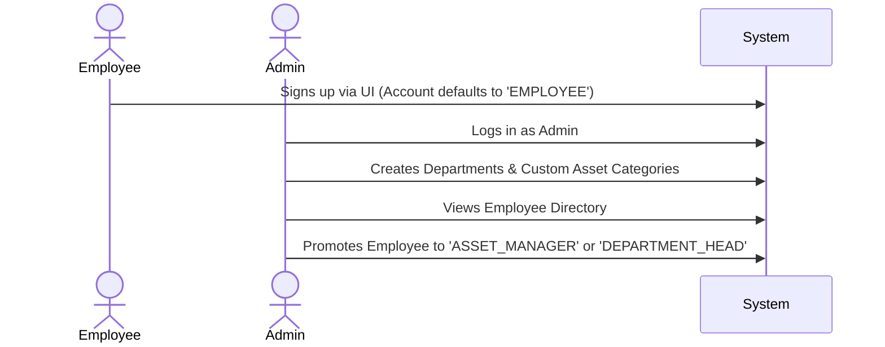
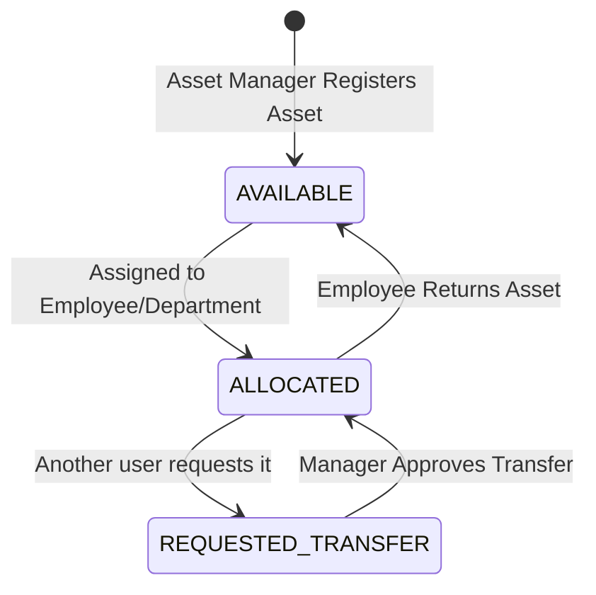
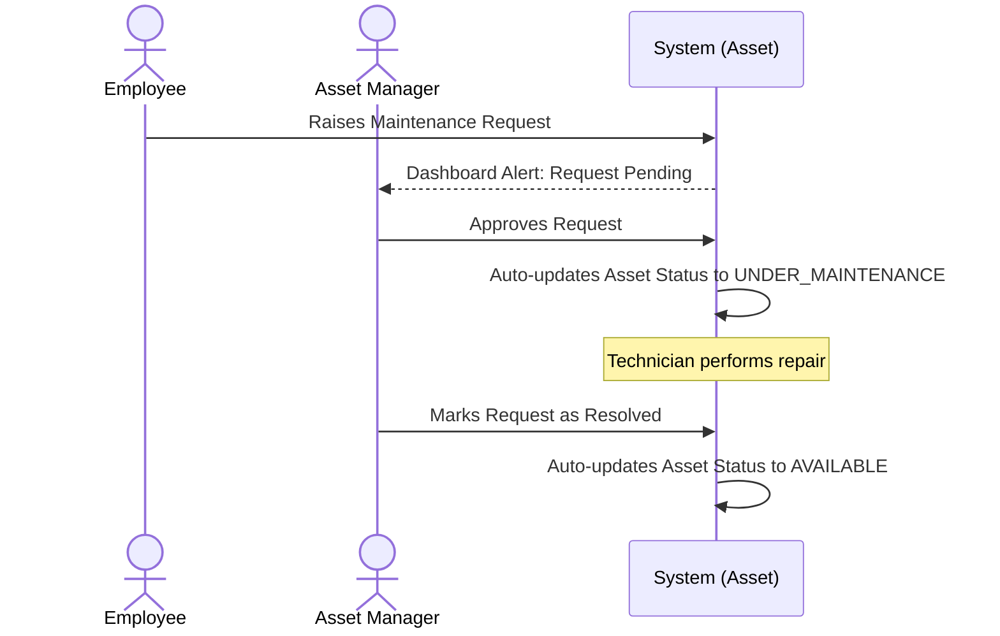
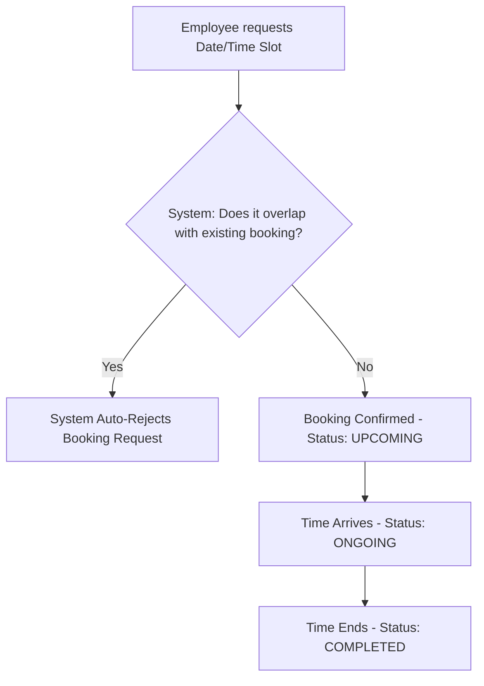
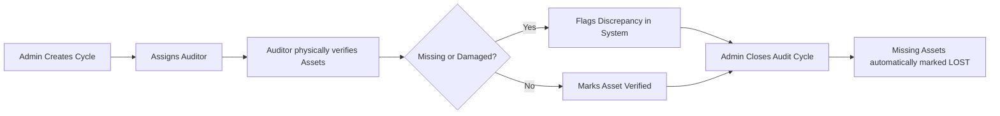

# AssetFlow User Workflows & Functionalities

This document defines the core functionalities for each user role and visualizes the step-by-step lifecycles of assets and requests within AssetFlow.

## 1. User Roles & Functionalities

### Admin
- **Functionalities**: Creates and manages Departments, Asset Categories, and the Employee Directory. Promotes base employees to Asset Managers or Department Heads. Can initiate and close Audit Cycles.

### Asset Manager
- **Functionalities**: Registers new assets into the system. Approves or rejects asset transfer requests, maintenance requests, and audit discrepancies. Approves asset returns and captures condition check-in notes.

### Department Head
- **Functionalities**: Views all assets assigned to their specific department. Can approve allocation and transfer requests for employees within their department. Books shared resources on behalf of the department.

### Employee (Default Role)
- **Functionalities**: Views assets currently assigned to them. Requests new assets. Books shared resources (meeting rooms, projectors, vehicles). Raises maintenance tickets for broken assets.

---

## 2. Core Workflows (Visualized)

### A. Organization Onboarding Flow
How users enter the system and gain permissions.

### B. Asset Registration & Allocation Flow
How an asset moves from entering the system to being used and returned.

### C. Maintenance Approval Workflow
How a broken asset gets repaired while preventing usage.

### D. Shared Resource Booking Flow
How time-slot booking prevents overlaps for shared resources.

### E. Audit Cycle Workflow
How the company runs structured sweeps to find missing inventory.

